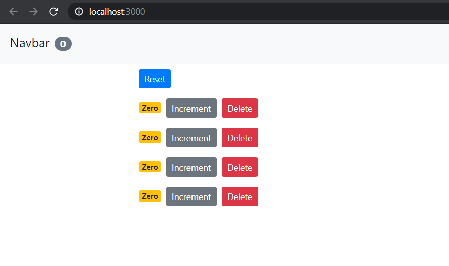
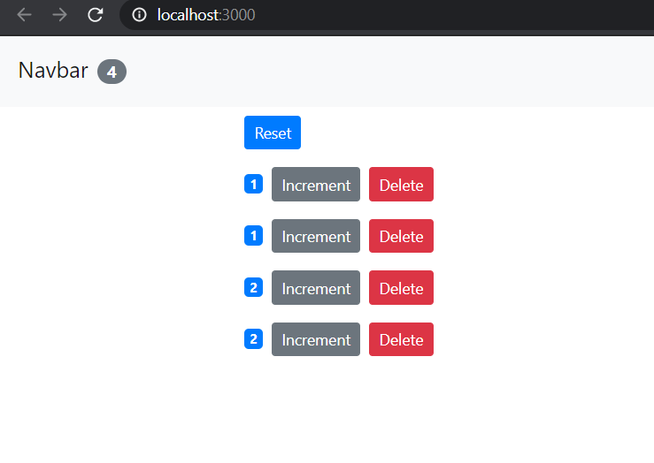

# Reactive Counter


### Project Structure

📦src
┣ 📂components
┃ ┣ 📜counter.jsx
┃ ┣ 📜counters.jsx
┃ ┗ 📜navbar.jsx
┣ 📜App.css
┣ 📜App.js
┣ 📜App.test.js
┣ 📜index.css
┣ 📜index.js
┣ 📜logo.svg
┣ 📜reportWebVitals.js
┗ 📜setupTests.js

# Javascript-made-simple

```javascript
// Factory Functions
function createCircle(radius) {
	return {
		// radius: radius,
		/* --> In ES6, we can eliminate 'noise', by removing the above line, and simply writing the radius, if the parameter to be used in the object is same*/
		radius,
		draw() {
			console.log("draw");
		},
	};
}

const circle = createCircle(2);

// Constructor Function
function Circle(radius) {
	// this keyword is a reference to the object, to set properties and methods;
	this.radius = radius;
	this.draw = function () {
		console.log("draw");
	};
}

const another = new Circle(1);
// new keyword creates an empty object: {}
// `this` will set the properties and methods;

// ADDING PROPERTIES

another.location = { x: 1 };
// OR
another["location"] = { x: 1 };

// DELETING PROPERTIES

delete another.location;
// OR
delete another["location"];
```

## OOP - Object Oriented Programming

Note: JavaScript doesn't have simething like classes, like in JAVA.

4 pillars of OOP

### Encapsulation

-   Instead of making functions all around (spaghetti code/procedural programming), grouping related variables (properties) & functions (methods)

Without encapsulation:

```javascript
let salary = 30000;
let overtime = 10;
let rate = 20;

function getWage(salary, overtime, rate) {
	return salary + overtime * rate;
}
```

With encapsulation: (Creating an object)

```javascript
let employee = {
	salary: 30000,
	overtime: 10,
	rate: 20,
	getWage: function () {
		return this.salary + this.overtime * this.rate;
	},
};

employee.getWage();
```

Advantage: No parameters in a function, simple we can refer the variable using the `this` keyword, referring to the variables that were grouped while creating an object.

##### Side Note:

In **ES6**, instead of writing longhand, we can use shorthand:

```javascript
let [salary, overtime, rate] = [30000, 10, 20];
```

Omitting the `function` keyword directly:

```javascript
let employee = {
	getWage() {
		// some code ...
	},
};
```

### Abstraction

-   Hiding some properties and methods.
    -   simpler advatage
    -   reduce impact of change

### Inheritance

-   Removing redundant code
    -   reusablity of code
    -   by creating a generic objects that can be inherited by creating customized objects.

### Polymorphism

-   Many - forms
-   Using `render()` for each elements, instead of multiple if else/ switch statements .


## Value vs Reference types

Primitives are copied by their value.

Objects are copied by their reference.

# _References_

-   [Top 5 Javascript Things You Should Know](https://youtu.be/v0QTqHXiVNw)
-   [Object-oriented Programming in JavaScript: Made Super Simple | Mosh](https://youtu.be/PFmuCDHHpwk)
-   [ES6 Tutorial: Learn Modern JavaScript](https://youtu.be/NCwa_xi0Uuc)
-   [ES6 Javascript Tutorial For Beginners | ES6 Crash Course](https://youtu.be/WZQc7RUAg18)
-   [React Tutorial for Beginners [React js]](https://youtu.be/Ke90Tje7VS0)

### _Demonstration_





# Getting Started with Create React App

This project was bootstrapped with [Create React App](https://github.com/facebook/create-react-app).

## Available Scripts

In the project directory, you can run:

### `npm start`

Runs the app in the development mode.
Open [http://localhost:3000](http://localhost:3000) to view it in the browser.

The page will reload if you make edits.
You will also see any lint errors in the console.

### `npm test`

Launches the test runner in the interactive watch mode.
See the section about [running tests](https://facebook.github.io/create-react-app/docs/running-tests) for more information.

### `npm run build`

Builds the app for production to the `build` folder.
It correctly bundles React in production mode and optimizes the build for the best performance.

The build is minified and the filenames include the hashes.
Your app is ready to be deployed!

See the section about [deployment](https://facebook.github.io/create-react-app/docs/deployment) for more information.

### `npm run eject`

**Note: this is a one-way operation. Once you `eject`, you can’t go back!**

If you aren’t satisfied with the build tool and configuration choices, you can `eject` at any time. This command will remove the single build dependency from your project.

Instead, it will copy all the configuration files and the transitive dependencies (webpack, Babel, ESLint, etc) right into your project so you have full control over them. All of the commands except `eject` will still work, but they will point to the copied scripts so you can tweak them. At this point you’re on your own.

You don’t have to ever use `eject`. The curated feature set is suitable for small and middle deployments, and you shouldn’t feel obligated to use this feature. However we understand that this tool wouldn’t be useful if you couldn’t customize it when you are ready for it.

## Learn More

You can learn more in the [Create React App documentation](https://facebook.github.io/create-react-app/docs/getting-started).

To learn React, check out the [React documentation](https://reactjs.org/).

### Code Splitting

This section has moved here: [https://facebook.github.io/create-react-app/docs/code-splitting](https://facebook.github.io/create-react-app/docs/code-splitting)

### Analyzing the Bundle Size

This section has moved here: [https://facebook.github.io/create-react-app/docs/analyzing-the-bundle-size](https://facebook.github.io/create-react-app/docs/analyzing-the-bundle-size)

### Making a Progressive Web App

This section has moved here: [https://facebook.github.io/create-react-app/docs/making-a-progressive-web-app](https://facebook.github.io/create-react-app/docs/making-a-progressive-web-app)

### Advanced Configuration

This section has moved here: [https://facebook.github.io/create-react-app/docs/advanced-configuration](https://facebook.github.io/create-react-app/docs/advanced-configuration)

### Deployment

This section has moved here: [https://facebook.github.io/create-react-app/docs/deployment](https://facebook.github.io/create-react-app/docs/deployment)

### `npm run build` fails to minify

This section has moved here: [https://facebook.github.io/create-react-app/docs/troubleshooting#npm-run-build-fails-to-minify](https://facebook.github.io/create-react-app/docs/troubleshooting#npm-run-build-fails-to-minify)
